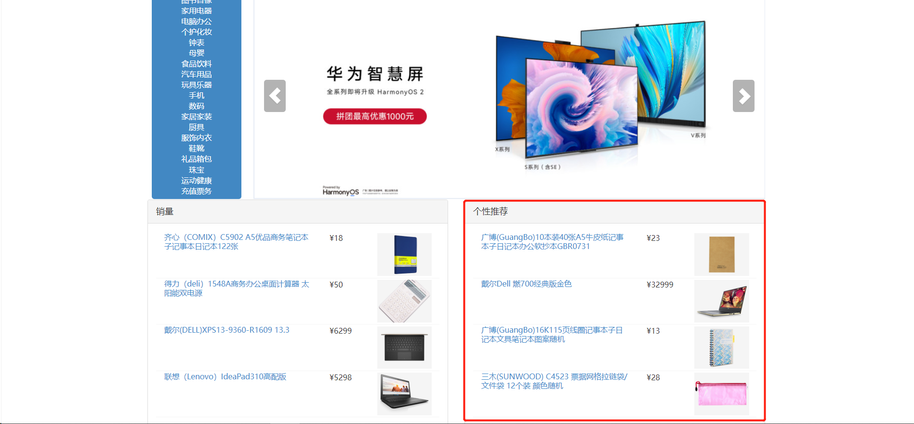
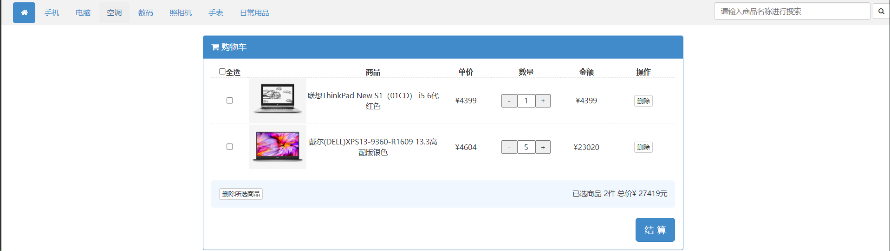
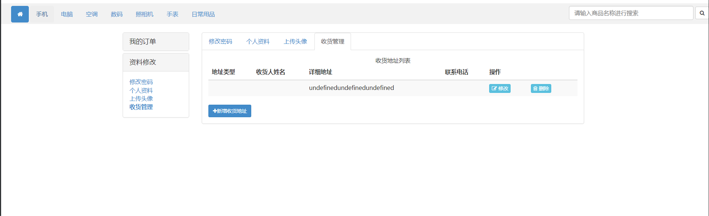

# hadoop-commodity-recommendation-master

#### 介绍
基于hadoop商品推荐系统

#### 软件架构
大数据架构:
基于物品的协同过滤算法主要有两步：

1、计算物品之间的相似度：可依据物品共现次数、余弦夹角、欧氏距离这三种方法计算得到物品之间的相似度。

2、根据物品的相似度和用户的历史购买记录给用户生成推荐列表

最终推荐的是什么物品，是由推荐度决定的。
核心：找出所有两两同时被购买商品出现的次数，
现在其中有用户购买了其中一个商品，推荐该商品组合另外一件商品

后端架构:

springboot + mybatis 框架

前端架构：
    HTML Ajax

#### 安装教程

1. 创建数据库并导入sql脚本
2. 运行com.cy.store.StoreApplication 主程序
3. 打开浏览器 localhost:8081 访问

4. 大数据运行: 解压 hadoop推荐算法 zip  搭建Hadoop然后运行，数据已经分析导入mysql，不再赘述

展示

注：红线是Hadoop 推荐算法完成

